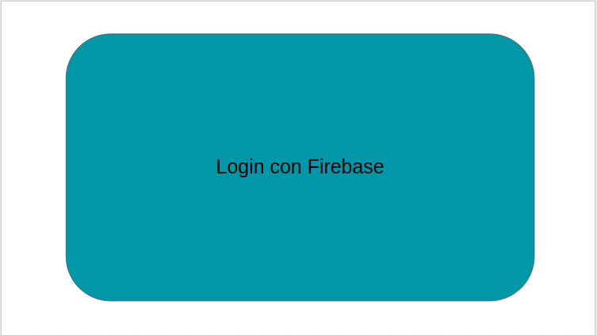
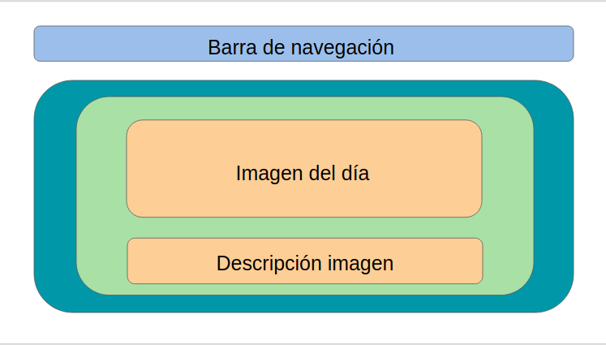
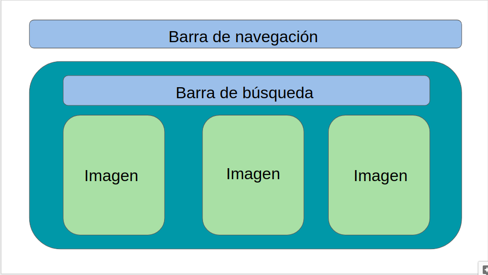
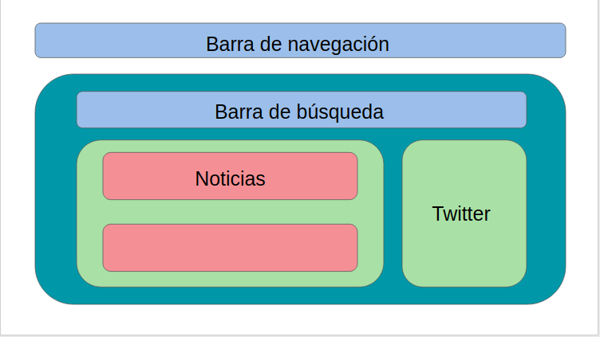

# NASANEWS

## **```Proyecto```**

NasaNews es una aplicación para poder mantenerte no solo informado sobre temas relacionados a la astronomía, sino que además, puedes acceder a la gran cantidad de imágenes disponibles de la **```Nasa```**, y a las últimas noticias publicadas en su cuenta de **```Twitter```**.


## **```Dependencias y herramientas```**


## **```Ambiente de Desarrollo```**

Utilizamos Javascript en VSCode para escribir nuestro proyecto. 


## **```React```**

Utilizamos react para crear tanto componentes funcionales como de clase, principalmente. Se realizaron cambios de estado, y se usaron ciclos de vida.


## **```Deploy```**

Se usó **```Firebase```** tanto para crear un login, como para realizar el deploy de la aplicación.

Link al proyecto [NASANews](https://project-nasa-news.firebaseapp.com/)

## Desarrollado para 
[Laboratoria](http://laboratoria.la)

## **```Wireframe```**






